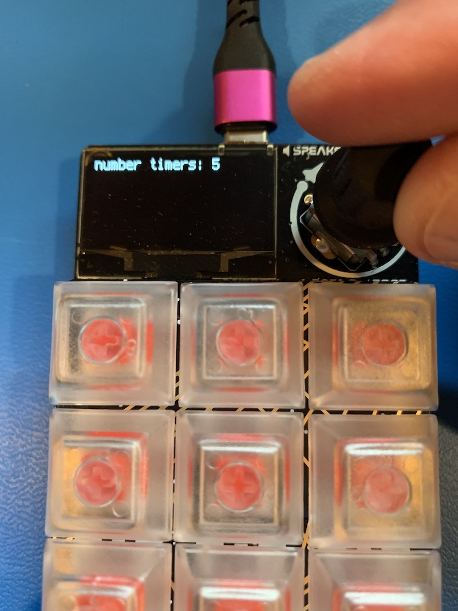

## Multiple Timers

This a simple circuitpython project that implements a set of 12 independent timers that can be configured as count up or down.

It is based on arduino and circuitpython files related to the ADABox019 kit with the MacroPad RS2040:  [MacroPad Overview](https://learn.adafruit.com/adafruit-macropad-rp2040/overview)
 
 

## Some Images

Upon Boot with data.txt 

Running 12 timers 

Enter Setup 

Number Timers 

Faster Speed 

 
 
## Usage

To configure the timers, press and hold the encoder knob (5-10 seconds) and follow the menu instructions, using the ecoder 
knob for input.

Once a number of count up/down timers, press the corresonding LED/key to start that timer.  Subsequent key presses
will pause/resume that timer.  A long push of that key will cause that timer to reset to its original setting in
a paused state.

Alternately, to start ALL timers press the encoder knob (1 second).  Similarly, you can pause ALL timers by pressing the encoder knob again.

Count up timers will display a solid green led, and dim when paused.  Count down timers will start as green and the 
color will vary with the percent of time remaining:
- green - greater that 70%
- yellow - between 40-70%
- orange - between 10-40%
- red - less that 10%

If data.txt is used, the Macropad will power up and show a number of timers ready to run. 

Another "fun" feature is turning the encoder know while the timers are running.  This will scale the clock speed by
the number shown in the upper right.
 
 

## How it Works

This was designed around the circuitpython Macropad libraries.  

The first implementation was actually a command line version to design the basic application and test independent of the Arduino hardware. 
As the original version was tweaked to fix issues that appeared using the real hardware, a series of "phase" versions was started.
(These can be found in the repo https://github.com/alpiepho/macropad/timers_cp).

Files:
- code.py - main source that should be installed in mounted CIRCUITPY directory
- data.txt - (optional) pre-setup of timers that can be added to CIRCUITPY directory
- circuitpython_libs - lib files etc for mounted CIRCUITPY directory to support lib references

Based on the latest implementation, the application consists of the following areas:
- library imports
- constants, structures, and some globals
- a section of macropad based "hardware" setup
- function specific to macropad
- timer specific functions
- menu functions and supporting globals
- check button function
- "application" setup
- main loop

Like all Arduino applications, this follows the pattern of setup and loop forever.
The main loop:
1. checks buttons
2. checks menu input
3. updates timer data structures
4. diplays those timer structures
 
 

## Learnings

- circuitpython is much nicer to use that standard Arduino C code.  
- circuitpython has decent support in VS Code
- circuitpython VS Code Serial Monitor is nice, but can hang easily
- coding the cmdline version made development of concept go faster
- macropad libraries easy to use, decent documentation
- ran into library/hardware limits on button presss, and consistent update speed
- biggest problem is providing consistent timer rate independent of the number of timers
- macropad is no longer completely isolated due to tweaks to fix performance issues
- got sucked into tweaking the on-device code.py to fix timing issues, should have stuck to Progress List
- current implementation work, but the timing is not consistent, and not synced to a real clock
- did figure out how to use time.monotonic_ns() to approximate real time
- figured out a way to present menues with the display and encoder
 
 

## Known Issues
- The response time of the encoder button is flaky.
- The long press to reset a time is not as consistent as I would like.

 
 

## Progress List

- [done] Each timer will be associated with a key
- [done] Each timer will display on screen in form 00:00 in specific location on display
- [done] Each timer can count down or count up in seconds
- [done] Each timer can be started, paused, resume, reset with the associated key
- [done] Long Key press = reset
- [done] Single Key press
    - [done] if not running -> running
    - [done] if running and not paused -> paused
    - [done] if running and paused -> not paused
- [done] The color of each timer will reflect the state of the timer
    - [done] if count down
        - [done] if not running -> green/dim
        - [done] if running and not paused
            - [done] 100% - 70% time remaining -> green/flashing
            - [done] 70% - 40% time remaining -> yellow/flashing
            - [done] 40% - 10% time remaining -> orange/flashing
            - [done] 10% - 0% time remaining -> red/flashing
            - [done] 0% time remaining -> red/solid
        [done] if running and paused -> above with solid/dim
    - [done] if count up
        - [done] if not running -> green/dim
        - [done] if running and not paused
            - [done] green/flashing
        [done] if running and paused -> above with solid/dim
- [done] Each timer may play tone when done?
- [done] Encoder is used to change overall settings
- [done] Long encoder press  -> reset all and enter menu
    - [done] menu: number
- [done]] encoder press -> pause/play all
- [done] menu states:
- [done] - long press -> show help
- [done] menu_state = 1 (help)
- [done] - press -> accept
- [done] menu_state = 2 (timer count)
- [done] - "number timers: 1"
- [done] - up/down -> +/-
- [done] - press -> accept
- [done] for each timer
- [done]     menu_state = 3 (timer direction)
- [done]     - "direction: up/down"
- [done]     - up/down -> up/down
- [done]     - press -> accept
- [done]    if down
- [done]          menu_state = 4 (timer start)
- [done]          - "timer start: min:sec"
- [done]          - up/down -> 00:00
- [done]          - press -> accept
- [done]          menu_state = 5 (timer sound)
- [done]          - "sound: y/n"
- [done]          - up/down -> y/n
- [done]          - press -> accept
- [done] ""enc. press/hold -> start/reset""

- [done] If all timers ready and waiting, display "enc. press/hold -> start/reset"
- [done] If all timers ready and waiting, single encoder press -> start all
- [done] If all timers running, single encoder press -> pause all
- [done] If all timers running, single encoder press -> start all again
- [done] base structure
- [done] class Timer(): pass
- [done] t = Timer()
- [done] t.direction = 1 | -1
- [done] t.start_time in seconds
- [done] t.current_time in seconds
- [done] t.running bool
- [done] t.paused bool
- [done] build code_test.py to test hw related functions
- [done] turn on code_test.py
- [done] merge in cmdline.py core timer logic
- [done] turn on full timer application
- [done] CONSTANTS
- [done] update README for how it works and how to use it
- [done] gather needed libs AND other files
- [done] review for refactor
- [done] debug consistent rate independent of number timers running (use DEBUG)
- [done] debug rate vs real time
- [defer] persist settings? (saving requires changing the SD card access mode, too complicated for this project)
